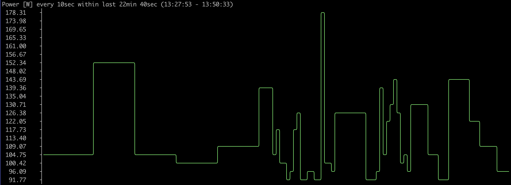

Phritzbox
=========

[](https://github.com/teqneers/phritzbox/actions/workflows/ci.yml)
[](https://github.com/teqneers/phritzbox/actions/workflows/security.yml)
[](https://codecov.io/gh/teqneers/phritzbox)
[](https://www.php.net/)
[](https://symfony.com/)
[](LICENSE)

CLI companion for AVM Fritz!Box smart home devices. Collects, stores and monitors data from smart outlets, thermostats and temperature sensors via the AHA HTTP API.


Requirements
------------

* PHP 8.5+
* SQLite (`ext-pdo_sqlite`)
* SimpleXML (`ext-simplexml`)
* A Fritz!Box with smart home devices


Installation
------------

```bash
git clone https://github.com/teqneers/phritzbox.git
cd phritzbox/app && composer install && cd ..
cp .env .env.local
```

Edit `.env.local` and set your Fritz!Box credentials and database path:

```dotenv
APP_API_USERNAME=your-username
APP_API_PASSWORD=your-password
APP_API_DOMAIN=http://fritz.box          # or https://abcd1234.myfritz.net

DATABASE_URL="sqlite:///%kernel.project_dir%/../data/database.sqlite"
```

Run the initial database migration:

```bash
php app/bin/console doctrine:migrations:migrate
```


CLI Commands
------------

All commands are run from the repo root:

```bash
php app/bin/console COMMAND [options]
```

| Command | Description |
|---------|-------------|
| `smart:device:list` | List all available SmartHome devices |
| `smart:device:stats` | Show statistics of a SmartHome device |
| `smart:switch:list` | List all known SmartHome outlets |
| `smart:switch:on <ain>` | Turn on a SmartHome outlet |
| `smart:switch:off <ain>` | Turn off a SmartHome outlet |
| `smart:switch:toggle <ain>` | Toggle power state of a SmartHome outlet |
| `smart:switch:power <ain>` | Read current power consumption [mW] |
| `smart:switch:energy <ain>` | Read energy delivered over outlet [Wh] |
| `smart:switch:present <ain>` | Check availability of a SmartHome outlet |
| `smart:switch:name <ain>` | Get name of a SmartHome outlet |
| `smart:temperature <ain>` | Read temperature of a SmartHome device [°C] |
| `smart:src:on <ain>` | Turn on a smart radiator control |
| `smart:src:off <ain>` | Turn off a smart radiator control |
| `smart:src:setpoint <ain>` | Read or set target temperature [°C] |
| `smart:src:comfort <ain>` | Read comfort temperature setpoint [°C] |
| `smart:src:saving <ain>` | Read saving temperature setpoint [°C] |
| `smart:template:list` | List all available SmartHome templates |
| `cron:smart:savestats` | Collect and persist all device data |


Screenshots
-----------

**Device listing** (`smart:device:list`):


**Statistics** (`smart:device:stats`):





Data Collection
---------------

The `cron:smart:savestats` command fetches all device data and stores new readings. Run it regularly via cron:

```cron
# collect smart home data twice an hour
*/30 * * * *   /path-to-phritzbox/app/bin/console cron:smart:savestats
```

The Fritz!Box caches device data. Temperature readings are available for up to 24 hours — if not fetched in time they are lost. Running every 30 minutes is recommended for most current data.


Development
-----------

**Run tests:**
```bash
php app/vendor/bin/phpunit --configuration app/phpunit.xml.dist
```

**Check code style:**
```bash
./app/vendor/bin/php-cs-fixer fix --diff --dry-run -v --config app/.php-cs-fixer.dist.php
```

**Auto-fix code style:**
```bash
./app/vendor/bin/php-cs-fixer fix --config app/.php-cs-fixer.dist.php
```

**Lint YAML config:**
```bash
php app/bin/console lint:yaml app/config --parse-tags
```

**Validate Doctrine mapping:**
```bash
php app/bin/console doctrine:schema:validate --skip-sync
```

**Check for security vulnerabilities:**
```bash
cd app && composer audit
```


Docker
------

```bash
cd docker && docker-compose up
```

The PHP container mounts `app/` for code, `data/` for the database, and `var/` for cache and logs.