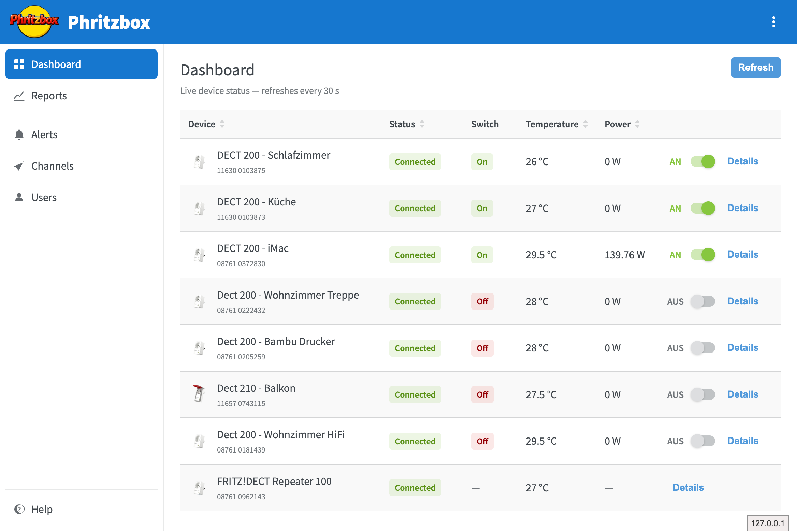
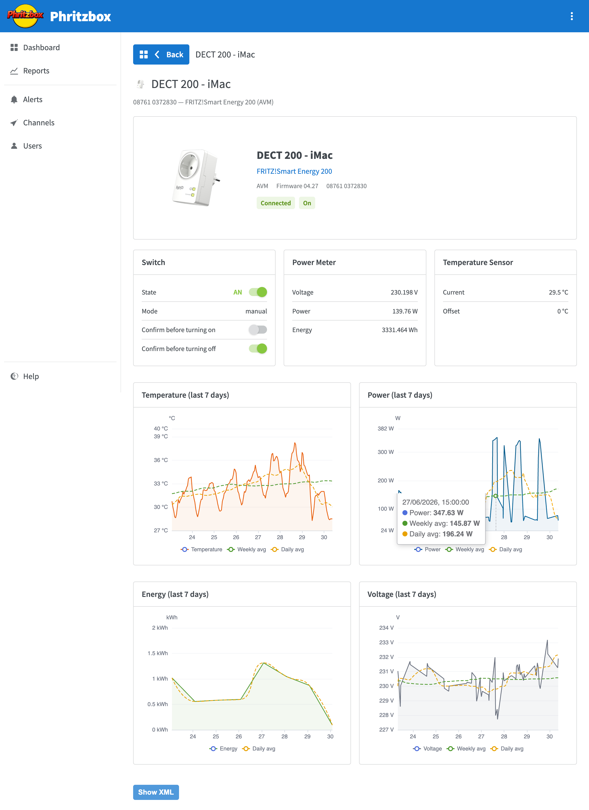
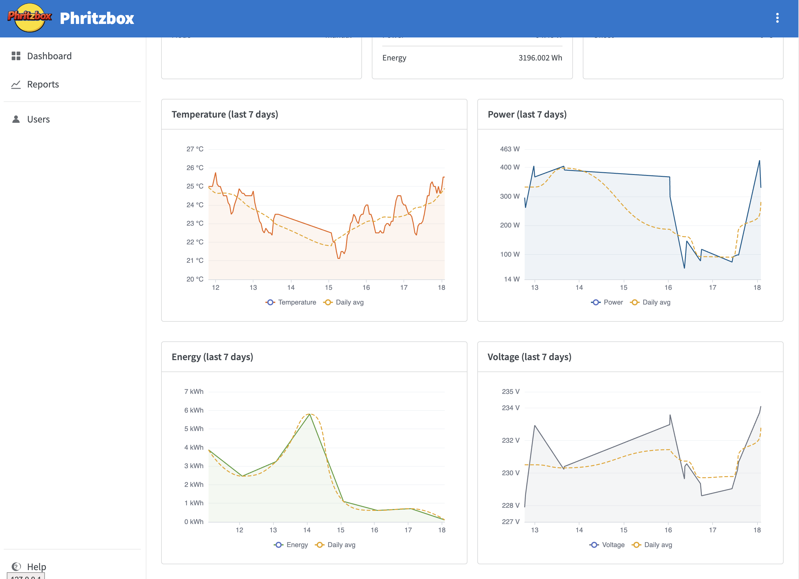
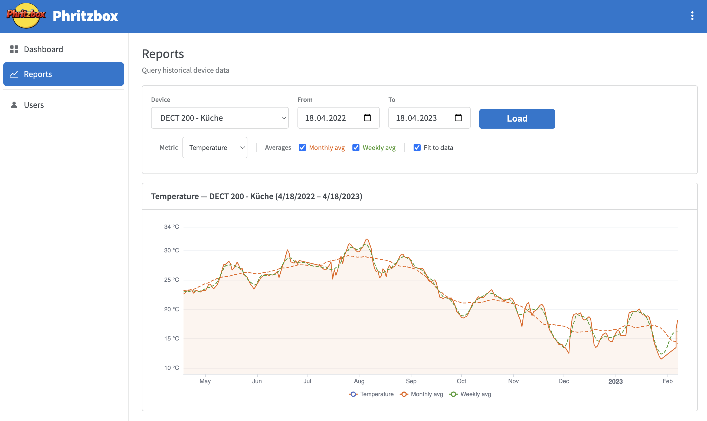
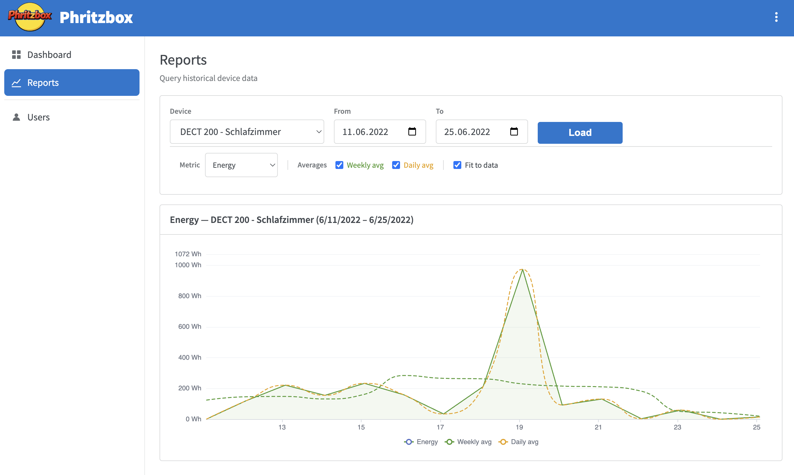
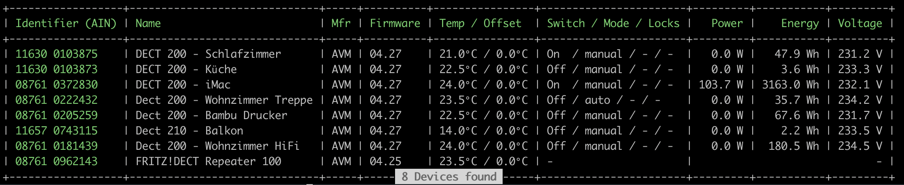
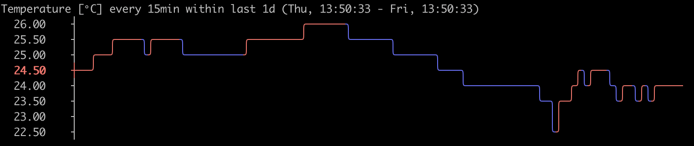
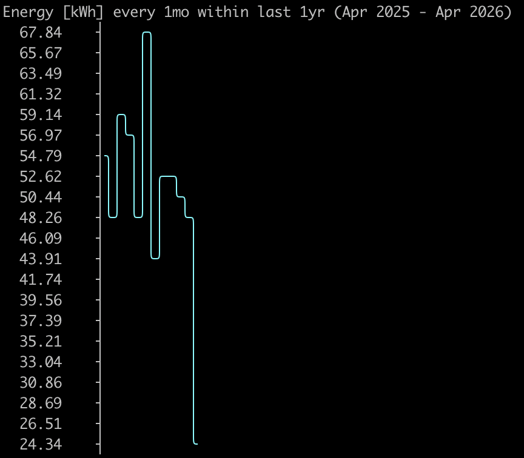
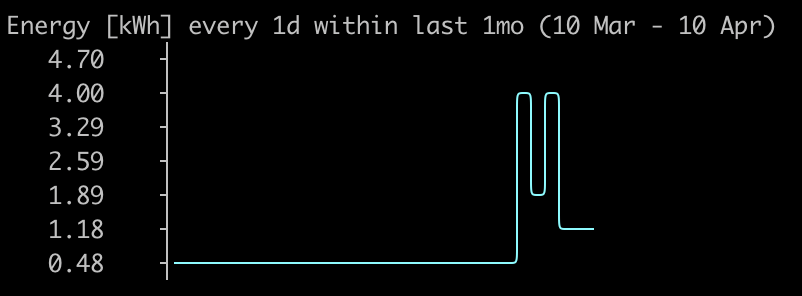

Phritzbox
=========

[](https://github.com/ogmueller/phritzbox/actions/workflows/ci.yml)
[](https://github.com/ogmueller/phritzbox/actions/workflows/docker.yml)
[](https://github.com/ogmueller/phritzbox/actions/workflows/security.yml)
[](https://codecov.io/gh/ogmueller/phritzbox)
[](https://ghcr.io/ogmueller/phritzbox)
[](LICENSE)

A self-hosted smart home dashboard for smart devices connected to AVM Fritz!Box. Monitor temperatures, power consumption, and energy usage with interactive charts. Control smart outlets and radiator thermostats from your browser or the command line.

Built with Symfony 8, React 18, and [FrankenPHP](https://frankenphp.dev). Ships as a single Docker image.


Screenshots
-----------

**Dashboard** — live overview of all devices with status, temperature, power consumption, and toggle switches:



**Device detail** — product image, firmware info, and feature cards for switch state, power meter, and temperature sensor:



**7-day charts** — interactive time-series charts for temperature, power, energy (kWh), and voltage with rolling daily averages:



**Reports** — query historical data for any device and date range, with selectable metric type and configurable averages:





Features
--------

- Live device status with 30-second auto-refresh
- Interactive charts for temperature, power, energy, and voltage
- Date-range reports with rolling averages
- 18 CLI commands for device control and monitoring
- User management with role-based access (admin only)
- German and English interface
- Automated data collection every 30 minutes (via [cronado](https://github.com/teqneers/cronado))
- Single Docker image — no PHP, Node.js, or Composer required


Quick Start
-----------

Requires [Docker](https://docs.docker.com/get-docker/) with Compose.

**Option A — Download the release zip** (recommended):

Download the latest `phritzbox-*.zip` from [Releases](https://github.com/ogmueller/phritzbox/releases), extract it, and copy `.env.dist` to `.env`:

```bash
unzip phritzbox-*.zip && cd phritzbox
cp .env.dist .env
```

**Option B — Fetch files manually:**

```bash
mkdir phritzbox && cd phritzbox
curl -L https://raw.githubusercontent.com/ogmueller/phritzbox/main/docker/compose.prod.yaml -o compose.yaml
curl -L https://raw.githubusercontent.com/ogmueller/phritzbox/main/docker/.env.dist -o .env
```

Edit `.env` with your Fritz!Box credentials, then start the application:

```bash
docker compose up -d
```

Visit `http://localhost` and log in with `admin` / `admin`.

> **Important:** Change the default password immediately after your first login.

To use a specific version instead of `latest`, edit the image tag in `compose.yaml`:

```yaml
image: ghcr.io/ogmueller/phritzbox:1.0.0   # tagged release
image: ghcr.io/ogmueller/phritzbox:nightly  # latest from main branch
```


Configuration
-------------

All settings are configured via environment variables in `.env`:

| Variable | Required | Default | Description |
|----------|----------|---------|-------------|
| `APP_API_USERNAME` | Yes | — | Fritz!Box login username |
| `APP_API_PASSWORD` | Yes | — | Fritz!Box login password |
| `APP_API_DOMAIN` | No | `http://fritz.box` | Fritz!Box address (or MyFRITZ! URL) |
| `APP_SECRET` | No | `change-me...` | Symfony application secret |
| `JWT_PASSPHRASE` | No | `change-me` | Passphrase for JWT key encryption |
| `SERVER_NAME` | No | `localhost` | Server hostname for Caddy |
| `PHRITZBOX_PORT` | No | `80` | Port to expose the web UI |


CLI Commands
------------

Using the release zip, run commands with the included `console` script:

```bash
./console COMMAND
```

Or via `docker compose exec` directly:

```bash
docker compose exec app php /application/app/bin/console COMMAND
```

Without Docker:

```bash
php app/bin/console COMMAND
```

| Command | Description |
|---------|-------------|
| `smart:device:list` | List all available SmartHome devices |
| `smart:device:stats` | Show statistics of a SmartHome device |
| `smart:switch:list` | List all known SmartHome outlets |
| `smart:switch:on <ain>` | Turn on a SmartHome outlet |
| `smart:switch:off <ain>` | Turn off a SmartHome outlet |
| `smart:switch:toggle <ain>` | Toggle power state of a SmartHome outlet |
| `smart:switch:power <ain>` | Read current power consumption [mW] |
| `smart:switch:energy <ain>` | Read energy delivered over outlet [Wh] |
| `smart:switch:present <ain>` | Check availability of a SmartHome outlet |
| `smart:switch:name <ain>` | Get name of a SmartHome outlet |
| `smart:temperature <ain>` | Read temperature of a SmartHome device [°C] |
| `smart:src:on <ain>` | Turn on a smart radiator control |
| `smart:src:off <ain>` | Turn off a smart radiator control |
| `smart:src:setpoint <ain>` | Read or set target temperature [°C] |
| `smart:src:comfort <ain>` | Read comfort temperature setpoint [°C] |
| `smart:src:saving <ain>` | Read saving temperature setpoint [°C] |
| `smart:template:list` | List all available SmartHome templates |
| `cron:smart:savestats` | Collect and persist all device data |


Data Collection
---------------

In the Docker setup, data collection runs automatically every 30 minutes via [cronado](https://github.com/teqneers/cronado).

For a bare-metal installation, set up a cron job:

```cron
*/30 * * * *   /path-to-phritzbox/app/bin/console cron:smart:savestats
```

The Fritz!Box caches device data. Temperature readings are available for up to 24 hours — if not fetched in time they are lost. Running every 30 minutes is recommended.


Development
-----------

### Requirements

* PHP 8.5+ with `pdo_sqlite` and `simplexml`
* Node.js 22+ and npm
* Composer 2
* A Fritz!Box with smart home devices

### Manual Installation

```bash
git clone https://github.com/ogmueller/phritzbox.git
cd phritzbox/app && composer install && cd ..
cp app/.env app/.env.local
```

Edit `app/.env.local` and set your Fritz!Box credentials:

```dotenv
APP_API_USERNAME=your-username
APP_API_PASSWORD=your-password
APP_API_DOMAIN=http://fritz.box
DATABASE_URL="sqlite:///%kernel.project_dir%/../data/database.sqlite"
```

Run the initial database migration:

```bash
php app/bin/console doctrine:migrations:migrate
```

### Docker (Development)

```bash
cd docker && docker compose up
```

The container mounts `app/`, `data/`, and `var/` as volumes for live code editing.

> **Note:** The Docker dev setup only runs the PHP backend. To work on the frontend, you need to start the Vite dev server separately (see below) or uncomment the `vite` service in `docker/compose.yaml`.

### Frontend

```bash
cd app/frontend && npm install
npm run dev     # dev server on :5173 (proxies /api to :80)
npm run build   # production build → app/public/frontend/
```

### Tests

```bash
php app/vendor/bin/phpunit --configuration app/phpunit.xml.dist
```

### Code Style

```bash
./app/vendor/bin/php-cs-fixer fix --diff --dry-run -v --config app/.php-cs-fixer.dist.php   # check
./app/vendor/bin/php-cs-fixer fix --config app/.php-cs-fixer.dist.php                       # fix
```

### Lint & Validate

```bash
php app/bin/console lint:yaml app/config --parse-tags
php app/bin/console doctrine:schema:validate --skip-sync
cd app && composer audit
```

### Building Docker Images Locally

```bash
docker build -f docker/Dockerfile.prod -t phritzbox .
```


<details>
<summary>CLI Screenshots</summary>

**Device listing** (`smart:device:list`):



**Statistics** (`smart:device:stats`):







</details>
